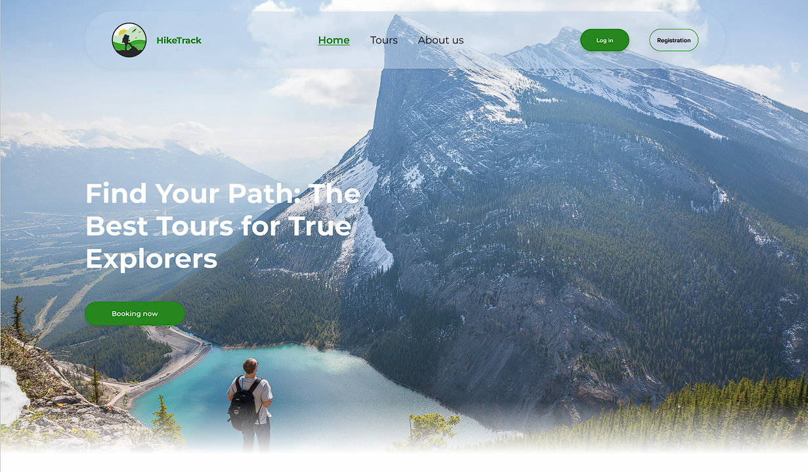

# Hike Track

[](https://github.com/HikeTrack/HikeTrack-Backend/commits/main)

[](https://hiketrack.github.io/hike-track-frontend/#/)
[](https://www.apache.org/licenses/LICENSE-2.0)
<a href="https://github.com/HikeTrack/HikeTrack-Backend/graphs/contributors" target="_blank">

</a>

# Welcome to HikeTrack-Backend! 🎉
Welcome to the HikeTrack-Backend repository, the backbone of the HikeTrack platform! This service powers 
our web application, providing seamless management of hiking tours, user profiles, reviews, and more.

Whether you're an adventure enthusiast looking to book and review hiking experiences or a developer 
diving into our project, Hike Track is designed to ensure a secure, efficient, and enjoyable journey.

Get ready to explore, contribute, and maybe even take HikeTrack for your own adventure! 🌄

<p align="center">
    
</p>

<div style="text-align: right; font-size: 34px; font-weight: bold;">
"Discover the Trails of Tomorrow, Today!"
</div>


<p align="center">
   <a href="#bulb-what-is-this-API-about">About</a> &nbsp;&bull;&nbsp;
   <a href="#bulb-technologies">Technologies</a> &nbsp;&bull;&nbsp;
   <a href="#bulb-business-logic">Business Logic</a> &nbsp;&bull;&nbsp;
   <a href="#bulb-notes">Notes</a> &nbsp;&bull;&nbsp;
   <a href="#-api-documentation">API Documentation</a> &nbsp;&bull;&nbsp;
   <a href="#bulb-downstream-services">Downstream Services</a> &nbsp;&bull;&nbsp;
   <a href="#bulb-upstream-services">Upstream Services</a> &nbsp;&bull;&nbsp;
   <a href="#bulb-deployment">Deployment</a> &nbsp;&bull;&nbsp;
   <a href="#bulb-contributors">Contributors</a> &nbsp;&bull;&nbsp;
   <a href="#bulb-contacts-and-authors">Contacts and Authors</a> &nbsp;&bull;&nbsp;
   <a href="#bulb-license">License</a>
</p>

## :bulb: What is this API about?

The HikeTrack-Backend API is a RESTful service designed to support a hiking tour management application.
It provides various endpoints that allow users to interact with the platform, offering functionalities 
for:

User Authentication and Authorization: Manage user registration, login, password resets, and logout. 
The API uses JWT (JSON Web Tokens) and OAuth2 (e.g., Google) for secure user sessions.

Country and Tour Management: Admins or authorized users can add, update, and delete countries and tours. 
The API allows users to search for hiking tours based on various criteria like difficulty, route type, activity, country, and price.

Review Management: Users can leave reviews on specific tours, update or delete their reviews, 
and view all reviews they’ve written. This feature encourages feedback and enhances the user experience.

User Profile Management: Users can edit their profiles, including personal information and photos, rate tours, 
and bookmark favorite tours for quick access.

Token Management: Redis is used to manage temporary tokens for password reset, confirmation links and
session handling.

Essentially, this API serves as the backend for a hiking platform, facilitating the complete flow from user 
authentication and profile management to tour discovery, booking, review submission, and bookmarking. 
This makes it ideal for applications where users want to find, explore, and share hiking experiences.


## :bulb: Technologies


| Name                        | Version   |
|-----------------------------|-----------|
| Spring Boot                 | 3.3.3     |
| Spring Data JPA             | 3.3.3     |
| Spring Web                  | 3.3.3     |
| Liquibase                   | 4.18.2    |
| MySQL Connector J           | 8.0.33    |
| Lombok                      | 1.18.24   |
| Spring Boot Starter Test    | 3.3.3     |
| Spring Boot Starter Actuator| 3.3.3     |
| Springdoc Openapi UI        | 1.8.0     |
| Testcontainers MySQL        | 1.20.1    |
| MapStruct                   | 1.6.0     |
| JJWT API                    | 0.11.5    |
| JJWT Impl                   | 0.11.5    |
| JJWT Jackson                | 0.11.5    |
| MapStruct Processor         | 1.5.5.Final|
| Spring Security Core        | 6.3.3     |
| Spring Security Web         | 6.3.3     |
| Spring Security Config      | 6.3.3     |
| Spring Boot Starter OAuth2 Client | 3.3.3 |
| Spring Boot Starter Data Redis | 3.3.3 |
| Spring Boot Starter Mail    | 3.3.3     |
| Maven                       | 3.9.9     |
| Checkstyle                  | 3.5.0     |
| Docker                      | latest    |
| Redis                       | 7.4.0     |
| MySQL                       | 8.0.33    |


## Project Structure

<p align="center">
    
</p>

### MySQL Database Structure

<p align="center">
    
</p>


## :bulb: Business Logic

### Authentication

- **Registration**: Allows users to create new accounts with email, password, first name, and last name.
- **Login**: Enables users to authenticate using their email and password.
- **Forgot Password**: Provides a mechanism for users to reset their passwords by sending a reset link to their email.
- **Update Password**: Allows users to update their passwords after receiving a reset link.
- **Logout**: Logs users out of their accounts.

### Country Management

- **Create Country**: Allows authorized users to create new countries with name, continent, and photo.
- **Search Countries**: Enables users to search for countries based on continent or country name.
- **Get Country by ID**: Retrieves a specific country by its ID.
- **Get All Countries**: Retrieves a list of all countries.

### Tour Management

- **Create Tour**: Allows authorized users to create new tours with name, length, price, date, difficulty, country ID, main photo, and tour details.
- **Update Tour**: Allows authorized users to update existing tours.
- **Delete Tour**: Allows authorized users to soft delete tours, making them invisible to users.
- **Get All Tours**: Retrieves a list of all tours.
- **Get Tour by ID**: Retrieves a specific tour by its ID, including tour details and reviews.
- **Get Most Rated Tours**: Retrieves a list of the top 7 most rated tours.
- **Search Tours**: Enables users to search for tours based on various parameters, including route type, difficulty, length, activity, date, duration, price, and country.

### Review Management

- **Create Review**: Allows users to create reviews for tours.
- **Delete Review**: Allows users to delete their own reviews.
- **Update Review**: Allows users to update their own reviews.
- **Get All Reviews by User**: Retrieves a list of all reviews created by a specific user.

### User Profile Management

- **Update User Profile**: Allows users to update their profile information, including country, city, and user photo.
- **Get User Profile**: Retrieves the profile information of the currently logged-in user.
- **Add Tour to Bookmarks**: Allows users to add tours to their bookmarks.
- **Get Bookmarks**: Retrieves a list of all tours bookmarked by the currently logged-in user.
- **Delete Tour from Bookmarks**: Allows users to remove tours from their bookmarks.


## :bulb: Dependency Management

- **Maven**: Used for dependency management and project build.
- **Maven Wrapper**: Ensures consistent Maven versions across development environments.


## :bulb: Notes

- **Liquibase**: Used for database migrations.
- **Spring Security**: Used for authentication and authorization.
- **JWT**: Used for authentication tokens.
- **OAuth2**: Used for Google authentication.
- **Redis**: Used for storing temporary tokens.
- **Springdoc OpenAPI**: Used for API documentation.
- **Testcontainers**: Used for testing with Docker containers.
- **MapStruct**: Used for object mapping.
- **Lombok**: Used for code generation.
- **Checkstyle**: Used for code style enforcement.


## 📄 API Documentation

<p>The HikeTrack API documentation is available through Swagger or the live website. You can explore all available endpoints, view request/response formats, and test the API directly from your browser.</p>

<p align="center">
   <a href="http://ec2-54-93-237-212.eu-central-1.compute.amazonaws.com/swagger-ui/index.html#/" style="text-decoration: none;">
      
   </a>
   <a href="https://hiketrack.github.io/hike-track-frontend/?#/" style="text-decoration: none;">
      
   </a>
</p>

<p><em>Note: The live website is still in progress by other frontend developer.</em></p>

### Authentication

- `POST /auth/registration` - Register a new user
- `POST /auth/login` - Login a user
- `POST /auth/forgot-password` - Send a password reset link to the user's email
- `GET /auth/reset-password` - Validate the password reset link and redirect to the password reset page
- `POST /auth/update-password/{email}` - Update the user's password
- `POST /auth/logout` - Logout the user

### Country Management

- `POST /countries/new` - Create a new country
- `GET /countries/search` - Search for countries
- `GET /countries/{id}` - Get a country by ID
- `GET /countries` - Get all countries

### Tour Management

- `POST /tours/new` - Create a new tour
- `PUT /tours/{tourId}` - Update a tour
- `DELETE /tours/{id}` - Delete a tour
- `GET /tours` - Get all tours
- `GET /tours/{id}` - Get a tour by ID
- `GET /tours/popular` - Get the most rated tours
- `GET /tours/search` - Search for tours

### Review Management

- `POST /tours/{tourId}/reviews` - Create a new review for a tour
- `DELETE /tours/{tourId}/reviews/{reviewId}` - Delete a review
- `PUT /tours/{tourId}/reviews/{reviewId}` - Update a review

### User Profile Management

- `POST /profile/bookmarks/new` - Add a tour to bookmarks
- `PUT /profile` - Update the user's profile
- `GET /profile/bookmarks` - Get all bookmarks
- `GET /profile` - Get the user's profile
- `DELETE /profile/bookmarks/{tourId}` - Delete a tour from bookmarks


## :bulb: Downstream Services

- **MySQL**: Database for storing application data
- **Redis**: Cache for JWT tokens and password reset requests
- **Google OAuth2**: Authentication provider for Google logins
- **Mail Server**: Server for sending password reset emails


## :bulb: Upstream Services

- **Frontend**: Client application that interacts with the backend API


## :bulb: Deployment

### Summary

- The project can be deployed to AWS Elastic Beanstalk using the provided GitHub workflow.
- The project can be deployed to Docker Hub using the provided GitHub workflow.


## Setting Up the Development Environment

### Prerequisites

1. **Install Java Development Kit (JDK)**:
    - Download and install JDK 17 from [Oracle](https://www.oracle.com/java/technologies/downloads/#java17).

2. **Install Maven**:
    - Download and install Maven from [Apache Maven](https://maven.apache.org/download.cgi).

3. **Install Docker**:
    - Download and install Docker Desktop from [Docker](https://www.docker.com/products/docker-desktop).

4. **Install Redis**:
    - Download and install Redis from [Redis](https://redis.io/docs/getting-started/install/).

5. **Install MySQL**:
    - Download and install MySQL from [MySQL](https://dev.mysql.com/downloads/mysql/).

### Set Up Environment Variables

Create a `.env` file in the project root directory and set the following environment variables:

Here is an example of .env file [**.env.example**](https://github.com/HikeTrack/HikeTrack-Backend/blob/main/.env.example).

### Running the Project in the Development Environment

1. **Start MySQL**:
    - Open a terminal and navigate to the MySQL installation directory.
    - Run the following command:
      ```
      mysqld --defaults-file=/path/to/my.cnf
      ```

2. **Start Redis**:
    - Open a terminal and navigate to the Redis installation directory.
    - Run the following command:
      ```
      redis-server
      ```

3. **Build the Project**:
    - Open a terminal and navigate to the project root directory.
    - Run the following command:
      ```
      mvn clean install
      ```

4. **Run the Application**:
    - Open a terminal and navigate to the project root directory.
    - Run the following command:
      ```
      mvn spring-boot:run
      ```

5. **Access the Application**:
    - Open a web browser and navigate to `http://localhost:8080`.

### Execution Instructions

#### Local

```mvn spring-boot:run```

Run the application using Maven.

#### Debug

```mvn spring-boot:run -Dspring-boot.run.jvmArguments="-agentlib:jdwp=transport=dt_socket,server=y,suspend=n,address=*:$DEBUG_PORT"```

Run the application in debug mode with the specified debug port.

#### Docker

```docker-compose up -d```

Build and run the application in a Docker container using Docker Compose.


## :bulb: Contributors

Contributions are always welcome!

If you want to contribute to this project, please read the [**contribution guide**](https://github.com/Vadym-Ozi/Online-Book-store/blob/master/docs/CONTRIBUTING.md).


## :bulb: Contacts and Authors

### Project Authors
- **Vadym Pantielieienko** - [GitHub](https://github.com/Vadym-Ozi) | [LinkedIn](https://linkedin.com/in/vadympantielieienko)

### Contact Information
If you have any questions, suggestions, or feedback, feel free to reach out:

- **Email**: VadymPantielieienko@gmail.com


## :bulb: License

This project is licensed under the Apache License 2.0 - see the [LICENSE](LICENSE) file for details.
